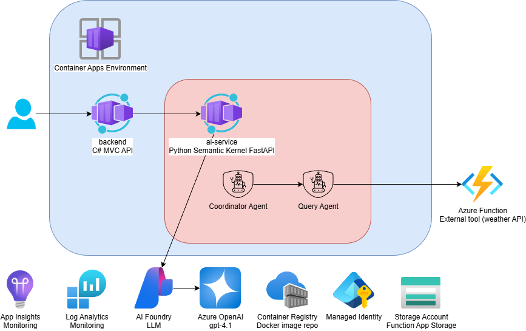

# Multi-Container Chat Application with Azure AI Foundry



A multi-tier chat application demonstrating Azure Container Apps, Azure Functions, and Azure AI Foundry integration with Semantic Kernel.

## Architecture

- **Frontend**: React application served from .NET API
- **Backend**: C# .NET 8 MVC API (Azure Container Apps)
- **AI Service**: Python FastAPI with Semantic Kernel (Azure Container Apps)
- **Weather Function**: Python Azure Function (tool for AI agent)
- **Infrastructure**: Terraform with Azure Developer CLI (azd)

## Quick Start

### Using Azure Developer CLI (Recommended)

```bash
# Install azd
curl -fsSL https://aka.ms/install-azd.sh | bash  # Linux/macOS
# or
winget install microsoft.azd  # Windows

# Login to Azure
az login

# Provision infrastructure and deploy
azd up
```

See [AZD-DEPLOYMENT.md](./AZD-DEPLOYMENT.md) for detailed azd documentation.

### Local Development

```bash
# Run with Docker Compose
docker compose up
```

Access the application at http://localhost:8080

## Disclaimer

**THE SOFTWARE IS PROVIDED "AS IS", WITHOUT WARRANTY OF ANY KIND, EXPRESS OR IMPLIED, INCLUDING BUT NOT LIMITED TO THE WARRANTIES OF MERCHANTABILITY, FITNESS FOR A PARTICULAR PURPOSE AND NONINFRINGEMENT. IN NO EVENT SHALL THE AUTHORS OR COPYRIGHT HOLDERS BE LIABLE FOR ANY CLAIM, DAMAGES OR OTHER LIABILITY, WHETHER IN AN ACTION OF CONTRACT, TORT OR OTHERWISE, ARISING FROM, OUT OF OR IN CONNECTION WITH THE SOFTWARE OR THE USE OR OTHER DEALINGS IN THE SOFTWARE.**

## Prerequisites

- [Azure Developer CLI](https://aka.ms/azd-install)
- [Azure CLI](https://docs.microsoft.com/en-us/cli/azure/install-azure-cli)
- [Docker Desktop](https://www.docker.com/products/docker-desktop)
- [Terraform](https://www.terraform.io/downloads) >= 1.1.7
- Azure subscription

## Project Structure

```
├── .azure/                 # azd environment configurations
├── infra/                  # Terraform infrastructure code
│   ├── modules/           # Reusable Terraform modules
│   └── main.tf            # Root Terraform configuration
├── src/
│   ├── backend/           # C# .NET 8 MVC API
│   ├── ai-service/        # Python FastAPI + Semantic Kernel
│   └── weather-function/  # Python Azure Function
├── azure.yaml             # Azure Developer CLI configuration
└── docker-compose.yml     # Local development setup
```

## Deployment Options

### Option 1: Azure Developer CLI (azd) - Recommended

Complete end-to-end deployment with one command:

```bash
azd up
```

See [AZD-DEPLOYMENT.md](./AZD-DEPLOYMENT.md) for:

- Detailed deployment steps
- Environment management
- CI/CD pipeline setup
- Troubleshooting guide

### Option 2: Manual Terraform Deployment

See [infra/DEPLOYMENT.md](./infra/DEPLOYMENT.md) for manual Terraform deployment instructions.

## Key Features

- **Streaming Chat**: Real-time streaming responses from AI agent
- **Tool Calling**: AI agent can invoke Azure Function to get weather data
- **Managed Identity**: Keyless authentication to Azure AI Foundry
- **Observability**: Application Insights integration with OpenTelemetry
- **Infrastructure as Code**: Complete Terraform modules for Azure resources
- **Developer Workflow**: Simplified deployment with Azure Developer CLI

## AI Foundry Integration

The application uses Azure AI Foundry for AI capabilities:

- **GPT-4o Chat Completion** - Azure AI Foundry account with deployed model
- **Semantic Kernel** - AI orchestration framework with automatic function calling
- **Tool Registration** - Weather function registered as callable tool for AI agent
- **Managed Identity** - Container apps authenticate to AI Foundry using user-assigned MI

## Links

- [Azure Developer CLI Documentation](https://learn.microsoft.com/azure/developer/azure-developer-cli/)
- [Azure Container Apps](https://learn.microsoft.com/azure/container-apps/)
- [Azure AI Foundry](https://learn.microsoft.com/azure/ai-foundry/)
- [Semantic Kernel](https://learn.microsoft.com/semantic-kernel/)
- [Terraform on Azure](https://learn.microsoft.com/azure/developer/terraform/)
